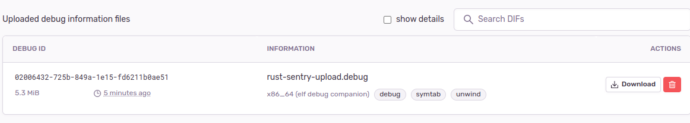
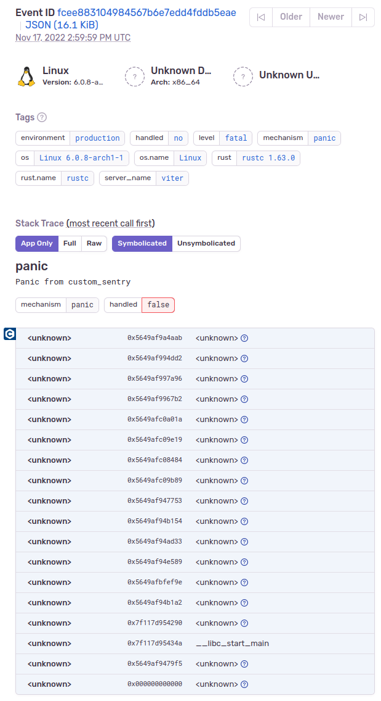
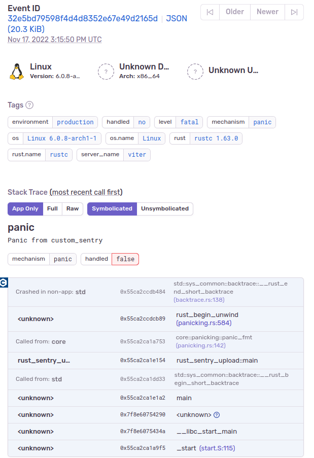

# IS SOLVED
https://github.com/getsentry/sentry-rust/issues/519

# Rust Sentry Upload Debug Information Not Matching
A small sample project so showcase the issue I'm having. Made as simple as possible, panics and reports back to sentry with as many defaults as possible.

## How To Run
* Setup a sentry project
* Install the `sentry-cli` application and run `sentry-cli login`
* `./run.sh https://valid@sentry.io/85 real-org real-project`
* Go to https://sentry.io/ and see your info

## Background Information
I'm using Yocto to build Rust normally on an embedded device with stripped binaries. 

But we could nevet get the "uploaded" debug information feature to work. It only ever works when the debug file itself is on the platform (but that defeats the purpose yea?).

I've tried setting up multiple Rust projects with various setups including:
* Using sentry-core to dump the event file as a .json file to upload later with Node. It works the same way, so no bueno. Also i see no way for how the .json file should possibly map to the uploaded sentry file, there's 0 unique binary identifiers.
* I've tried uploading sets of files (debug info and binary), the full file.
* I've tried stripping the file in various ways.
* With and without the debug flag in cargo.toml

In the end my conclusion is i can't see a way for how sentry could possibly map the event to any debug information uploaded. (Check out the .json files)

## Ressources i have checked out
* https://docs.sentry.io/platforms/rust/
* https://blog.sentry.io/2018/10/22/getting-started-with-rust-error-tracking/
* https://blog.sentry.io/2018/05/01/sentry-for-rust/

* https://github.com/getsentry/sentry-rust/issues/164

* https://docs.sentry.io/platforms/native/data-management/debug-files/upload/
* https://docs.sentry.io/platforms/native/data-management/debug-files/file-formats/#executable-and-linkable-format-elf
* https://docs.sentry.io/product/cli/dif/
* https://docs.sentry.io/product/cli/

* https://internals.rust-lang.org/t/emitting-build-id-when-linking-elf-binaries/15349

## Pictures
### Uploaded Debug Files

### Event

### Event (With the debug file ON the target)

